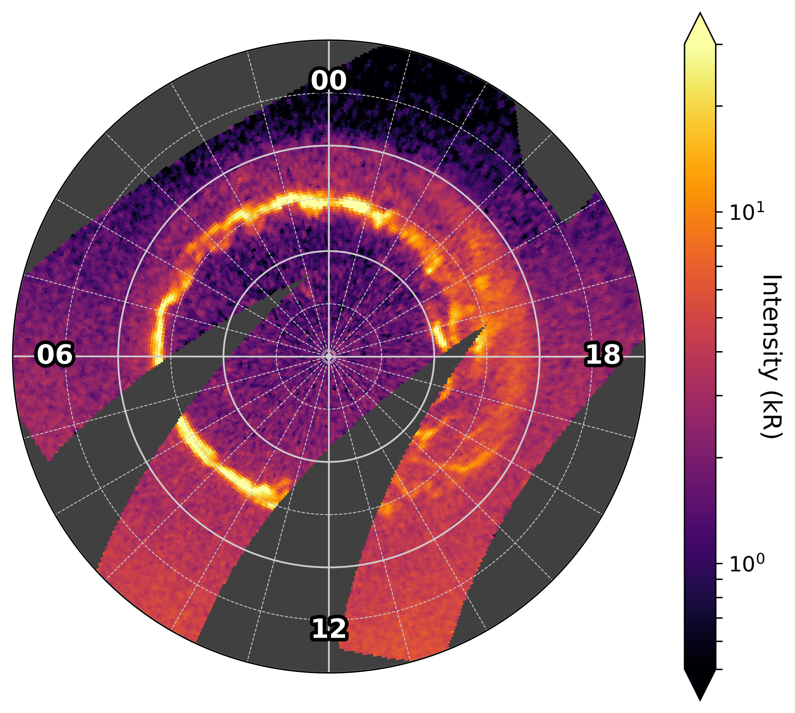

Usage Guide
===========

Here is some example code for getting started with the `UVISAurorae` package. This guide only explains the high-level
usage contained in ``uvisaurorae.executions``, but the lower-level functions contained in the remaining subpackages
can be used directly as well for complicated projection tasks requiring more flexibility.

General usage - setup and combining several files to a single image
-------------------------------------------------------------------

Let's start by deciding where on our machine we want to
keep all data needed for auroral projections - we need one folder for SPICE kernels, another folder for raw UVIS data
and, lastly, one folder to hold the projection files we will generate:

.. code:: python

    from pathlib import Path

    base_dir = Path("C:/users/lxbad/Desktop/uvis_projection_example")
    spice_dir = base_dir / "spice_data"
    uvis_dir = base_dir / "uvis_data"
    projection_dir = base_dir / "projections"

As you can can see, I just keep all of these in a folder on my desktop. Next we need to instantiate a
``UVISAuroralProjector``, an object handling the projection itself.

.. code:: python

    from uvisaurorae.projection import UVISAuroralProjector

    uvis_projector = UVISAuroralProjector(720, 720, spice_dir)

This is where we define the grid size of the projection - here we choose 720 bins in longitude and 720 bins in latitude.
The projection grid covers the entirety of Saturn, so this results in a resolution of 2 bins per degree longitude and 4
bins per degree latitude. The projector object also needs to know the location of SPICE kernels for performing the
projection.

If you want to see log output from this package, you can set this up using standard python logging - this snippet for
example will simply print all output to the console:

.. code:: python

    import logging

    logging.basicConfig(level=logging.INFO)

Now we're basically done with the setup and ready to do some projections! Projections are best defined as a standard
dictionary and executed using ``execute_projection_command`` from ``uvisaurorae.executions``:

.. code:: python

    from uvisaurorae.executions import execute_projection_command

    # Base command items which we can re-use for all projections
    cmd_base = dict(
        uvis_dir=uvis_dir,
        spice_dir=spice_dir,
        uvis_projector=uvis_projector,
        projection_dir=projection_dir,
        creator="LXBADER",
    )

    # Building a command for a specific projection
    my_projection_command = dict(
        **cmd_base,
        uvis_file_names=[
            "FUV2017_102_08_21",
            "FUV2017_102_09_14",
            "FUV2017_102_10_23",
        ],
        release_number=59,
        projection_mode="combine",
        clean=True,
        sensitivity=5,
    )

    execute_projection_command(
        my_projection_command
    )

The dictionary ``cmd_base`` contains some standard information which probably remains the same for all projections -
the directory paths we set up earlier (they will be created during the projection if they do not exist yet), the
``UVISAuroralProjector`` object we instantiated as well as the name of the creator. The more interesting bits come in
the actual command dictionary ``my_projection_command``: here we define which UVIS files we want to work with
(``uvis_file_names``), which PDS release they are a part of (``release_number``) and how we want to treat these files
(we want to combine them into a single image, so ``projection_mode = "combine"``). The last two keywords express that
we want to clean each single UVIS file for return scans and which sensitivity this is supposed to happen with - note
that sensitivity values have limited physical meaning and it may need some experimentation to find the right setting.
Finally, we simply execute this projection command.

The automatic download of the required SPICE kernels and UVIS files may take a while - UVIS files are unfortunately only
available uncompressed; and especially in the first execution a few SPICE kernels have to be downloaded which apply to
the entire Cassini mission.

.. parsed-literal::
    INFO:uvisaurorae.data_retrieval:Downloading SPICE kernel fk/cas_dyn_v03.tf
    INFO:uvisaurorae.data_retrieval:Successfully downloaded SPICE kernel fk/cas_dyn_v03.tf
    INFO:uvisaurorae.data_retrieval:Downloading SPICE kernel fk/cas_mimi_v202.tf
    INFO:uvisaurorae.data_retrieval:Successfully downloaded SPICE kernel fk/cas_mimi_v202.tf
    ...
    INFO:uvisaurorae.data_retrieval:Downloading UVIS file FUV2017_102_10_23.LBL
    INFO:uvisaurorae.data_retrieval:Successfully downloaded UVIS file FUV2017_102_10_23.LBL
    INFO:uvisaurorae.data_retrieval:Downloading UVIS file FUV2017_102_10_23.DAT
    INFO:uvisaurorae.data_retrieval:Compressing UVIS file FUV2017_102_10_23.DAT
    INFO:uvisaurorae.data_retrieval:Successfully downloaded UVIS file FUV2017_102_10_23.DAT
    INFO:uvisaurorae.projection:Starting projection in parallel mode
    INFO:uvisaurorae.projection:Auto setting to use 16 workers
    INFO:uvisaurorae.projection:Projection successful, took 12.1 seconds
    INFO:uvisaurorae.projection:Starting projection in parallel mode
    INFO:uvisaurorae.projection:Auto setting to use 16 workers
    INFO:uvisaurorae.projection:Projection successful, took 15.3 seconds
    INFO:uvisaurorae.projection:Starting projection in parallel mode
    INFO:uvisaurorae.projection:Auto setting to use 16 workers
    INFO:uvisaurorae.projection:Projection successful, took 13.0 seconds
    INFO:uvisaurorae.inout:Successfully saved file C:/users/lxbad/Desktop/uvis_projection_test/projections/2017_102T08_21_12.fits

Note that this example did not specify a number of workers to use, so was performed in parallel with 16 (number of
logical processors) workers. You can set the number of workers to use with the keyword ``n_workers``. In ``proj_dir``,
we can now find the projection saved as a ``.fits`` file; a subfolder ``previews`` contains a plot of the projected
image which should look like this:

Splitting data files
--------------------

Some UVIS data files can contain several images each, and one would want to project all images contained in the same
data file separately rather than all together into one projection. This can easily be done using a command structure
like

.. code:: python

    execute_projection_command(
        dict(
            **cmd_base,
            uvis_file_names=["FUV2017_167_20_15"],
            release_number=59,
            sensitivity=1,
            projection_mode="split",
        )
    )

in which ``projection_mode`` is set to ``"split"`` such that separate images are attempted to be automatically split out
by using SPICE attitude information to identify and remove return scans of the instrument. As previously, the
``sensitivity`` can be modified to result in an optimal split. Too low sensitivity leads to several images being
projected together, whereas too large sensitivity results in a single image being split across several projections.

Pre-set command list
--------------------

This library also contains a pre-set list of commands to project all UVIS auroral data collected during the Cassini
Saturn tour. It was hand-assembled and should encompass all available images; however, due to recent improvements of the
file splitting logic the ``sensitivity`` settings will require adjusting. This chronological list can be obtained
like so:

.. code:: python

    from uvisaurorae.executions import get_full_execution_list

    full_exec = get_full_execution_list()

Inspecting the first item, ``full_exec[0]``, we get a command for combining a number of files into a single image:

.. parsed-literal::
    {
        'uvis_file_names': [
            'FUV2007_096_00_36',
            'FUV2007_096_01_01',
            'FUV2007_096_01_26',
            'FUV2007_096_01_50',
            'FUV2007_096_02_15',
            'FUV2007_096_02_40'
        ],
        'release_number': 19,
        'projection_mode': 'combine',
        'clean': True
    }